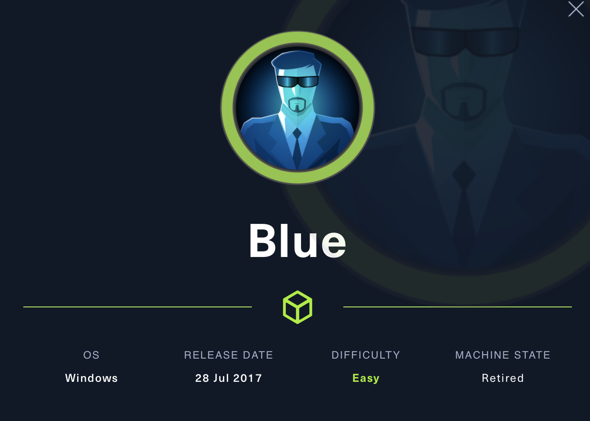
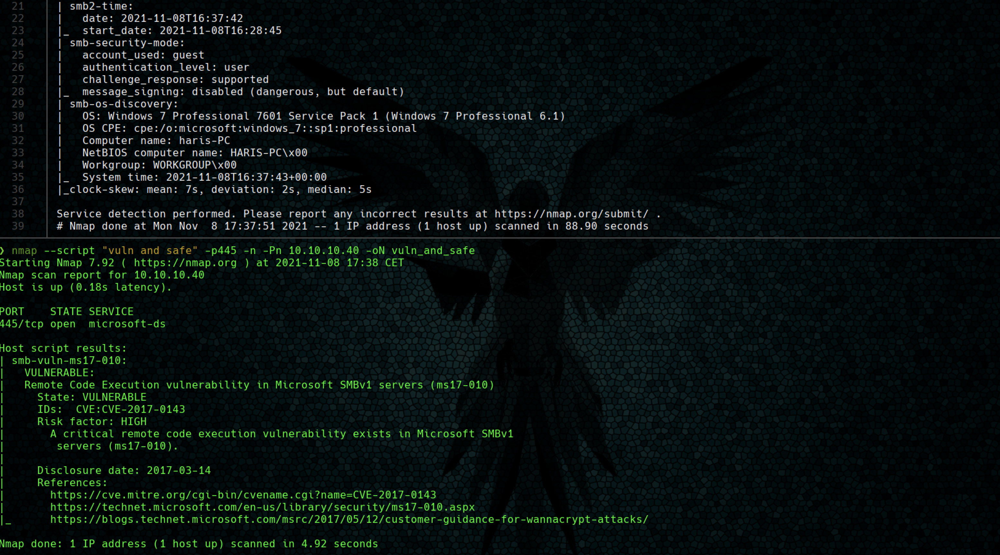

# Blue

**Índice**   
1. [Overview](#id1)
2. [Enumeración](#id2)
3. [Explotación](#id3)

#
## 1. Overview

|OS|Difficulty|Machine State|Vector|Priviledge Escalation|
|-|-|-|-|-|
|Windows|Easy|Retired|EthernalBlue|EthernalBlue|

## 2. Enumeración

### 2.1 Nmap

* Se realiza un escaneo intensivo de todas la vulnerabilidades de samba que tengan características **vuln and safe**.

El resultado arroja que la máquina es vulnerable a EthernalBlue.

## 3. Exploit - MS17-010

Se sigue el mismo procedimiento que en la máquina legacy.

Se utiliza el exploit de https://github.com/worawit/MS17-010 el cual dispone de un checker para testear si la máquina es vulnerable.

Este checker.py al inicio tiene dos variables para configurar el usuario y la contraseña de SMB. En esta ocasión el usuario es **guest** (usuario por defecto).

Finalmente se ejecuta **zzz_exploit.py** para obtener una shell remota. 

Para ello se debe modificar el script previamente. Filtrando por el comando "cmd" y en la función **smb_pwn** se comentan todas las lineas menos 1 que ejecuta comando. Se cambia el contenido para que ejecute una reverse shell con netcap compartido mediante un servicio samba en local.

Finalmente escuchamos en el puerto 443 con rlwrap.
