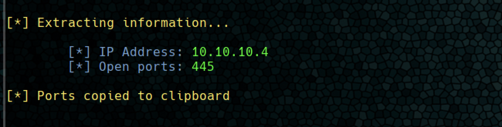
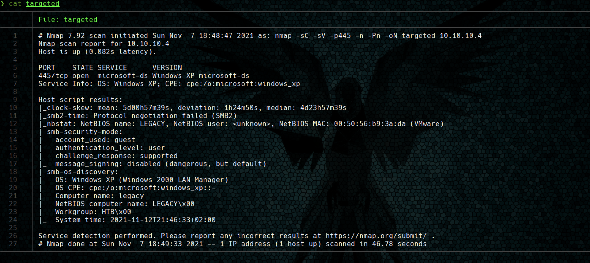
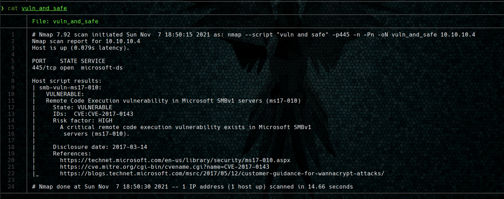
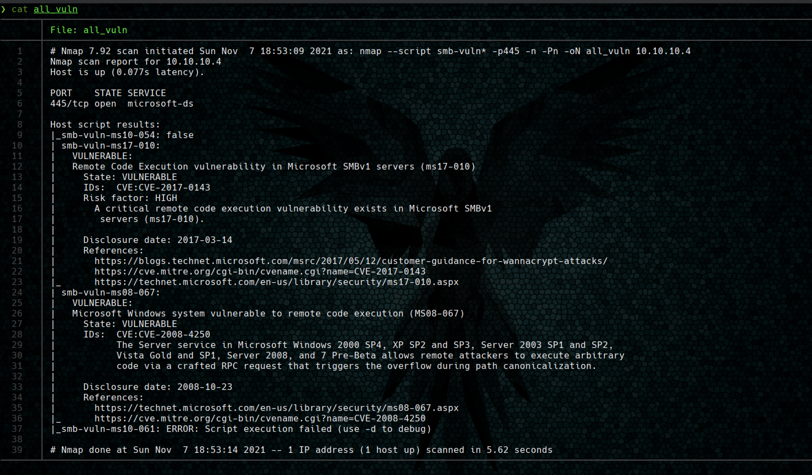
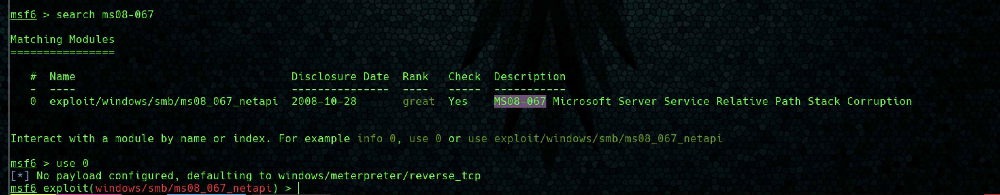
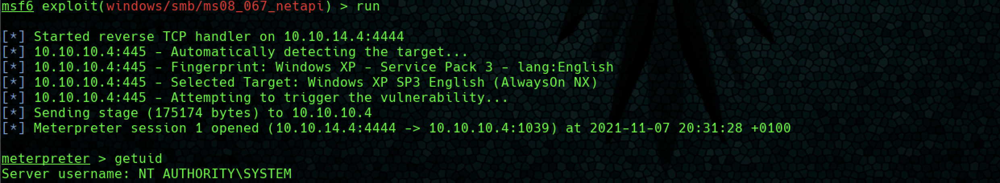
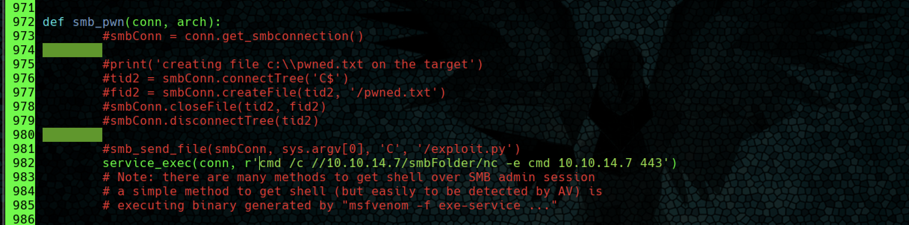
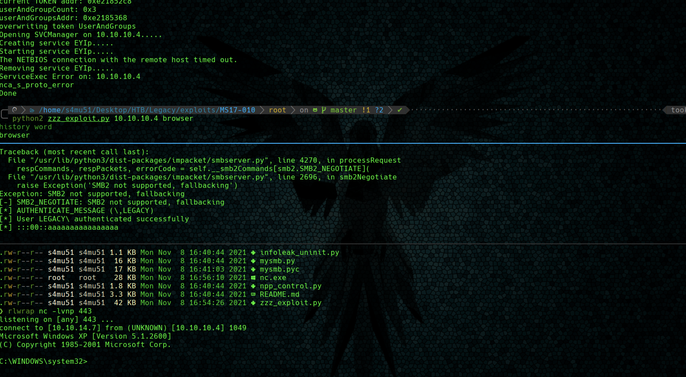
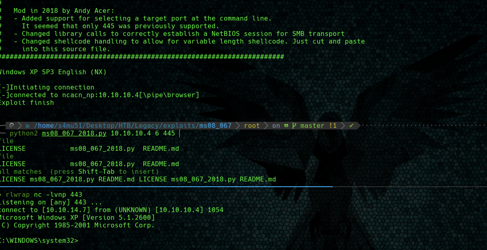

# Legacy


**Índice**   
1. [Overview](#id1)
2. [Enumeración](#id2)
3. [Explotación](#id3)

#
## 1. Overview<a name="id1"></a>

|OS|Difficulty|Machine State|Vector|Priviledge Escalation|
|-|-|-|-|-|
|Windows|Easy|Retired|EthernalBlue|EthernalBlue|

## 2. Enumeración<a name="id2"></a>

### 2.1 Nmap

* Escaneo Nmap





* Tras detectarse el servicio **SMB** abierto, se procede a lanzar el conjunto de scripts de nmap de caraceter **vuln and safe**.



* Al solo detectarse una unica vulnerabilidad (EthernalBlue), se lanza todo el conjunto de vulnerabilidades **smb-vuln**




## 3. Explotacion

### 3.1 Metasploit

#### 3.1.1 EhternalBlue (MS17-010)

Se consigue entrar en la máquina aprovechando la vulnerabilidad conocida como **EthernalBlue** haciendo uso de la herramienta mestasploit.

Para ello se emplea el módulo **ms17-010_ethernalblue**.

Tras lanzar el modulo se obtiene una shell como **NT Authority System**. Obteniendo las flags de user.txt y root.txt.

#### 3.1.2 MS08-067

Se explota la otra vulnerabilidad de samba con el uso de metasploit.





#### 3.2.1 Explotacion Manual MS17-010

Se busca en internet repositorios que ejecuten el exploit ms17-010. https://github.com/worawit/MS17-010. 



Se busca en la herramienta el comando "cmd". Se comentan las lineas anteriores y se descomenta una para entablar una reverse shell con nc. Recurso que se comparte con un servidor samba desde la máquina local.

```bash
impaket-smbserver smbFolder $(pwd) -smb2support
```




#### 3.2.1 Explotacion Manual MS08-067

El mismo procedimiento se sigue para MS08-067. Se busca en internet si existe algun repo RCE.

Para usar este exploit fue necesario crear el payload del buffer overflow siguiendo las instrucciones del script.



Ambos scripts finalizan obteniendo una shell con permisos de NT Authority System.