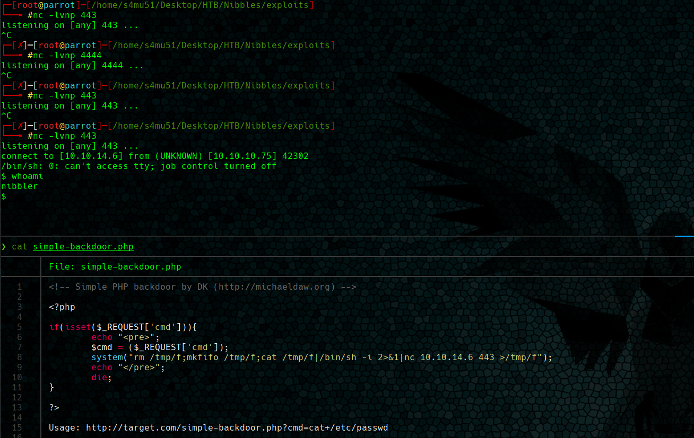

# Nibbles


**Índice**   
1. [Overview](#id1)
2. [Enumeración](#id2)
3. [Explotación](#id3)
4. [Priviledge Escalation](#id4)

#
## 1. Overview<a name="id1"></a>

|OS|Difficulty|Machine State|Vector|Priviledge Escalation|
|-|-|-|-|-|
|Linux|Easy|Retired|File Misconfiguration|Sudo|


#
## 2. Enumeración<a name="id2"></a>

### 2.1 Escaneo

Se realiza un escaneo **tcp port syn  scan** para detectar los puertos y servicios disponibles. El resultado se exporta al fichero grepeable allPorts.


Con la herramienta **Whatweb** se le echa un primer vistazo al contenido de la máquina. Tras no detectar nada destacable y haciendo uso de firefox se procede a analizar el contenido de la página web.


La página web está practicamente vacía lo que levanta sospechas. Se utilizan las **herramientas de desarrollador** de firefox para inspeccionar la página y se encuentra un comentario con un directorio.

```html
 <!--/nibbleblog/ directory. Nothing interesting here! -->
```

### 2.2 Nibbleblog

Una rápida busqueda en google revela que [Nibbleblog](https://www.nibbleblog.com/) es un tecnología web para crear blogs que utiliza PHP. Como todo gestor de contenidos es muy probable que tenga vulnerabilidades asociadas. En la siguiente figura, se aprecia 2 vulnerabilides asociadas a nibbleblog. 


La vulnerabilidad más reciente v4.0.3 (versión actual v4.0.5) permite ejecutar código php cuando el usuario está previamente autenticado. Si se analiza el código del exploit, se ve que trata de conectarser a direccion http://[dominio]/nibbleblog/admin.php para obtener la cookie de sesión.

* Exploit 38489
```bash
vprint_status("#{peer} - Authenticating using #{username}:#{password}")

cookie = do_login(username, password)
fail_with(Failure::NoAccess, 'Unable to login. Verify USERNAME/PASSWORD or TARGETURI.') if cookie.nil?
vprint_good("#{peer} - Authenticated with Nibbleblog."
```
* Panel de login (nibbleblog)


Se realizan varios intentos login para probar algunas combinaciones de usuario y contraseña. Finalmente se consegue hacer login con:

```bash
user: admin
password: nibbles
```

#
## 3. Explotación<a name="id3"></a>

Se procede a testear la vulnerabilidad **Upload File Arbitrary** tanto de forma manual como con metasploit.


### 3.1 Mestaploit


### 3.2 Manual - CVE-2015-6967

Analizamos el CVE-2015-6967 descrito en https://packetstormsecurity.com/files/133425/NibbleBlog-4.0.3-Shell-Upload.html. 

```bash
3. Proof of Concept
* Obtain Admin credentials (for example via Phishing via XSS which can be gained via CSRF, see advisory about CSRF in NibbleBlog 4.0.3) 
* Activate My image plugin by visiting
http://localhost/nibbleblog/admin.php?controller=plugins&action=install&plugin=my_image
* Upload PHP shell, ignore warnings
* Visit
http://localhost/nibbleblog/content/private/plugins/my_image/image.php.
```

Siguiendo las instrucciones de la POC. Se debe acceder a la dirección http://localhost/nibbleblog/admin.php?controller=plugins&action=install&plugin=my_image para activar el plugin vulnerable y subir la webshell. Finalmente, se accede http://localhost/nibbleblog/content/private/plugins/my_image/image.php para visualizar la webshell.

* /usr/share/webshells/php/simple-backdoor.php


* Nibbles


## OJO!!

En esta ocasión no dejaba ejecutar la shell directamente desde la url. Por tanto, incluimos directamente en la webshell el código que queremos que ejecute.

#
## 4. Escalada de Privilegios<a name="id3"></a>

* sudo


* root

